# Object Detection in an Urban Environment

## Introduction
There are two main parts of this project. The first part is to investigate the existing data set by plotting the figures with dounding boxes, which are color coded to represent three main traffice objects, including vehicles, cyclists, and pedestrians. The second objective of this project is to use pre-trained model and provided data to train a neural network model to detect the above three main traffic objects and improve the model performances using different methods, like data augmentation and tunning model hyper parameters.

### Suggestions For this Project
    1. There is a mistake in 'Explore augmentations.ipynb', the correct statment in "line 181" should be as following, and additional statements in            "line 181" prevent opening the notebook.
        
        line 181:    "display_name": "Python 3",
    
    2. The workspace always be automatically disconnected after 1 hour, and this stopps all neural network training process. This wasted lots of my time        because the traning stopped around 1200 steps. Unfortunately, I was not able to always check my 'workspace'. I really hope that the workspace          can be always connected as needed.
    
    3. The storage size of the workspace is a bit small. I changed the step size to be 3000 and I can not evaluate the model due to 'space not enough'.         I hope the space of the workspace could be larger
    
    4. I spent lots of time to get the evaluation history and wanted to plot together with the training history. Howver, I failed to do this and did not        find a way to do this. I hope some instructions could be given to plot the history of the evaluation process. 
    
## Data

For this project, we will be using data from the [Waymo Open dataset](https://waymo.com/open/).

[OPTIONAL] - The files can be downloaded directly from the website as tar files or from the [Google Cloud Bucket](https://console.cloud.google.com/storage/browser/waymo_open_dataset_v_1_2_0_individual_files/) as individual tf records. We have already provided the data required to finish this project in the workspace, so you don't need to download it separately.

## Structure

### Data

The data you will use for training, validation and testing is organized as follow:
```
/home/workspace/data/waymo
    - training_and_validation - contains 97 files to train and validate your models
    - train: contain the train data (empty to start)
    - val: contain the val data (empty to start)
    - test - contains 3 files to test your model and create inference videos
```

The `training_and_validation` folder contains file that have been downsampled: we have selected one every 10 frames from 10 fps videos. The `testing` folder contains frames from the 10 fps video without downsampling.

You will split this `training_and_validation` data into `train`, and `val` sets by completing and executing the `create_splits.py` file.

### Experiments
The experiments folder will be organized as follow:
```
experiments/
    - pretrained_model/
    - exporter_main_v2.py - to create an inference model
    - model_main_tf2.py - to launch training
    - reference/ - reference training with the unchanged config file
    - experiment0/ - create a new folder for each experiment you run
    - experiment1/ - create a new folder for each experiment you run
    - experiment2/ - create a new folder for each experiment you run
    - label_map.pbtxt
    ...
```

## Prerequisites

### Local Setup

For local setup if you have your own Nvidia GPU, you can use the provided Dockerfile and requirements in the [build directory](./build).

Follow [the README therein](./build/README.md) to create a docker container and install all prerequisites.

### Download and process the data

**Note:** Workspace was used and all the data are in the workspace folders

The first goal of this project is to download the data from the Waymo's Google Cloud bucket to your local machine. For this project, we only need a subset of the data provided (for example, we do not need to use the Lidar data). Therefore, we are going to download and trim immediately each file. In `download_process.py`, you can view the `create_tf_example` function, which will perform this processing. This function takes the components of a Waymo Tf record and saves them in the Tf Object Detection api format. An example of such function is described [here](https://tensorflow-object-detection-api-tutorial.readthedocs.io/en/latest/training.html#create-tensorflow-records). We are already providing the `label_map.pbtxt` file.

You can run the script using the following command:
```
python download_process.py --data_dir {processed_file_location} --size {number of files you want to download}
```

You are downloading 100 files (unless you changed the `size` parameter) so be patient! Once the script is done, you can look inside your `data_dir` folder to see if the files have been downloaded and processed correctly.

### Classroom Workspace

In the classroom workspace, every library and package should already be installed in your environment. You will NOT need to make use of `gcloud` to download the images.

## Exploratory Data Analysis

### Data Plot
The figures showed below are all from data/train

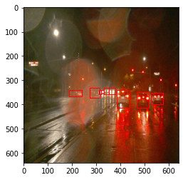
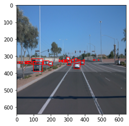
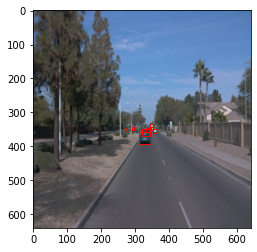
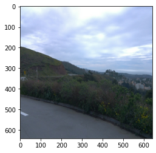
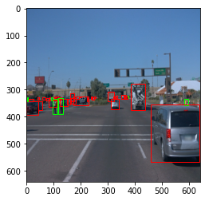
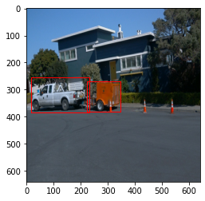
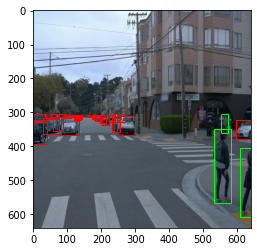
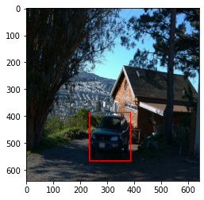
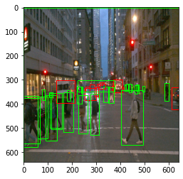
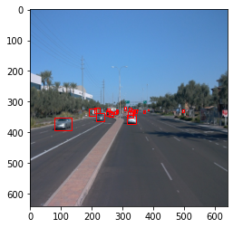

### Additional EDA

The statistic analysis has been conducted for both training and validation data sets to see the number of each object class (vehicle/bicycle/pedestrian)
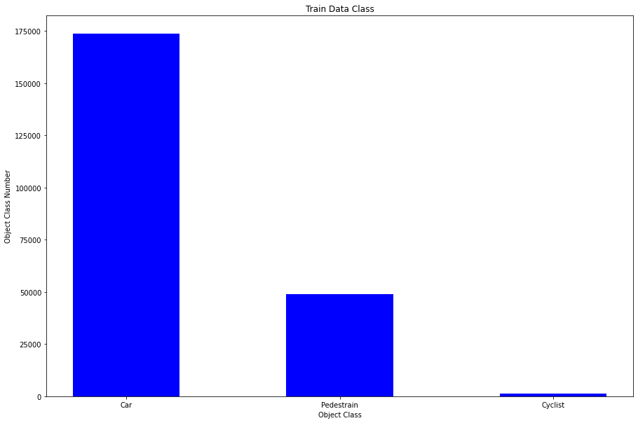
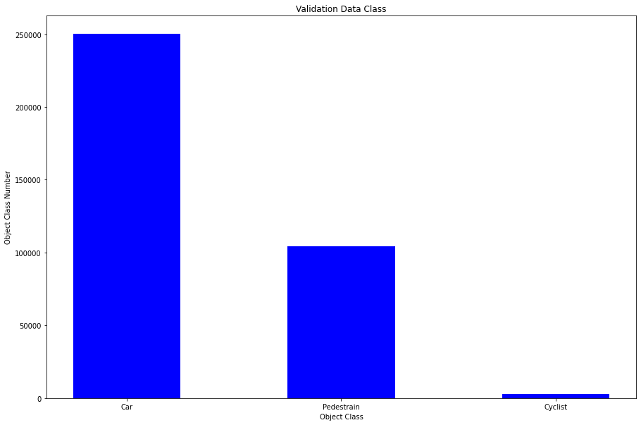


### Create the training - validation splits
Workspace was used and all the data are in the workspace folders


### Edit the config file

Now you are ready for training. As we explain during the course, the Tf Object Detection API relies on **config files**. The config that we will use for this project is `pipeline.config`, which is the config for a SSD Resnet 50 640x640 model. You can learn more about the Single Shot Detector [here](https://arxiv.org/pdf/1512.02325.pdf).

First, let's download the [pretrained model](http://download.tensorflow.org/models/object_detection/tf2/20200711/ssd_resnet50_v1_fpn_640x640_coco17_tpu-8.tar.gz) and move it to `/home/workspace/experiments/pretrained_model/`.

We need to edit the config files to change the location of the training and validation files, as well as the location of the label_map file, pretrained weights. We also need to adjust the batch size. To do so, run the following:
```
python edit_config.py --train_dir /home/workspace/data/train/ --eval_dir /home/workspace/data/val/ --batch_size 2 --checkpoint /home/workspace/experiments/pretrained_model/ssd_resnet50_v1_fpn_640x640_coco17_tpu-8/checkpoint/ckpt-0 --label_map /home/workspace/experiments/label_map.pbtxt
```
A new config file has been created, `pipeline_new.config`.

### Training

You will now launch your very first experiment with the Tensorflow object detection API. Move the `pipeline_new.config` to the `/home/workspace/experiments/reference` folder. Now launch the training process:
* a training process:
```
python experiments/model_main_tf2.py --model_dir=experiments/reference/ --pipeline_config_path=experiments/reference/pipeline_new.config
```
Once the training is finished, launch the evaluation process:
* an evaluation process:
```
python experiments/model_main_tf2.py --model_dir=experiments/reference/ --pipeline_config_path=experiments/reference/pipeline_new.config --checkpoint_dir=experiments/reference/
```

**Note**: Both processes will display some Tensorflow warnings, which can be ignored. You may have to kill the evaluation script manually using
`CTRL+C`.

To monitor the training, you can launch a tensorboard instance by running `python -m tensorboard.main --logdir experiments/reference/`. You will report your findings in the writeup.

#### The Initial Experiment

The following figures show the initial train/eval results using pre-trained model without any modifications. Since both train and eval total loss are very high, the initial pre-trainined model does not perform well. Need to have more training data and modify the pipeline_new configuration file

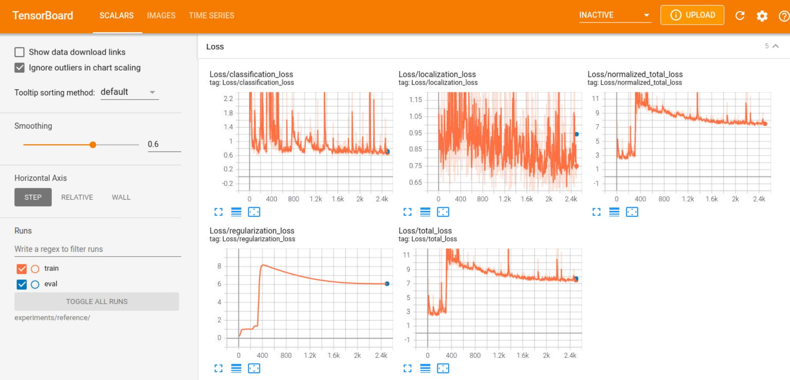


### Improve the performances

#### Data Augmentation Example

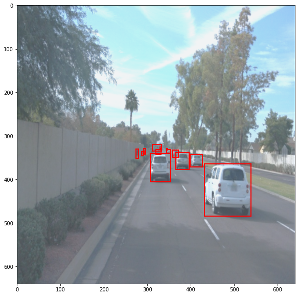
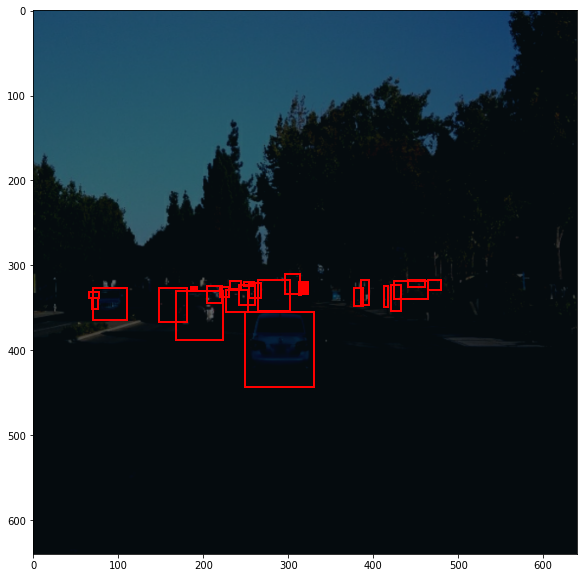


#### Exp1

The 'batch_size' in "line 131" in the initial pipeline_new.config was 300. The tach_size was reduced to be 5. At the same time, two data augmentation methods were added, 'random_adjust_brightness' and 'random_rgb_to_gray'. The num_steps was increased to 3000. The resuslts of Exp1 is showed in the figure below. Howver, the total loss of train and eval is stilll high

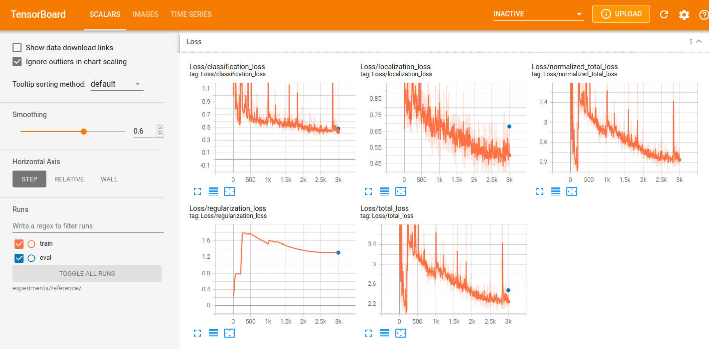

#### Exp2

The 'batch_size' was inreased to be 8. At the same time, more data augmentation methods were added, 'random_adjust_brightness' 'random_rgb_to_gray', 'random_adjust_hue', 'random_black_patches', 'random_jitter_boxes', 'random_horizontal_flip'. The result is showed in the figure below. The training results looks great. However, the evaluation can not be conducted due to the limited space of the workspace.

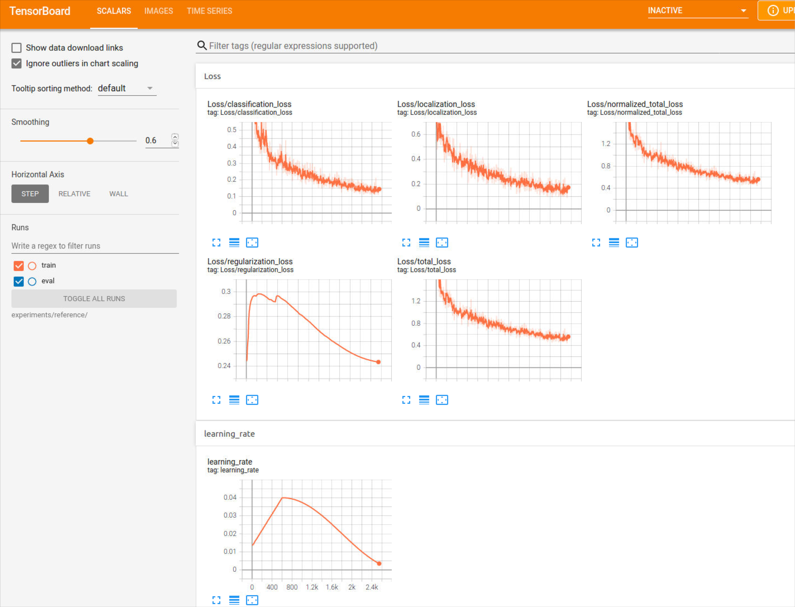

#### Exp3
The num_stesp was changed to 1200 due to the limited space. All the other parameters in pipline_new were same as Exp2. The results of train and evaluation are showed below. Although the evaluation error is a bit high, the overall model performance is good.
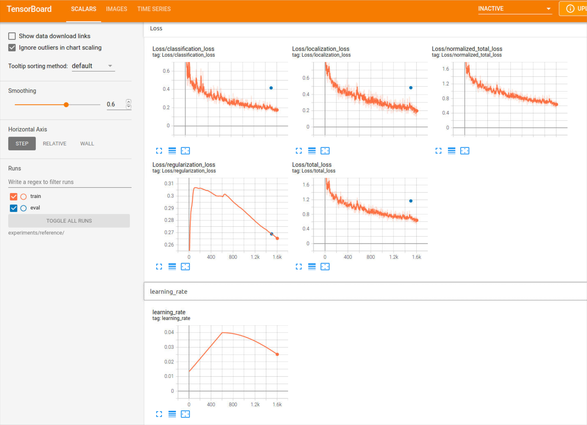


### Creating an animation
#### Export the trained model
Modify the arguments of the following function to adjust it to your models:

```
python experiments/exporter_main_v2.py --input_type image_tensor --pipeline_config_path experiments/reference/pipeline_new.config --trained_checkpoint_dir experiments/reference/ --output_directory experiments/reference/exported/
```

This should create a new folder `experiments/reference/exported/saved_model`. You can read more about the Tensorflow SavedModel format [here](https://www.tensorflow.org/guide/saved_model).

Finally, you can create a video of your model's inferences for any tf record file. To do so, run the following command (modify it to your files):
```
python inference_video.py --labelmap_path label_map.pbtxt --model_path experiments/reference/exported/saved_model --tf_record_path /data/waymo/testing/segment-12200383401366682847_2552_140_2572_140_with_camera_labels.tfrecord --config_path experiments/reference/pipeline_new.config --output_path animation.gif
```


